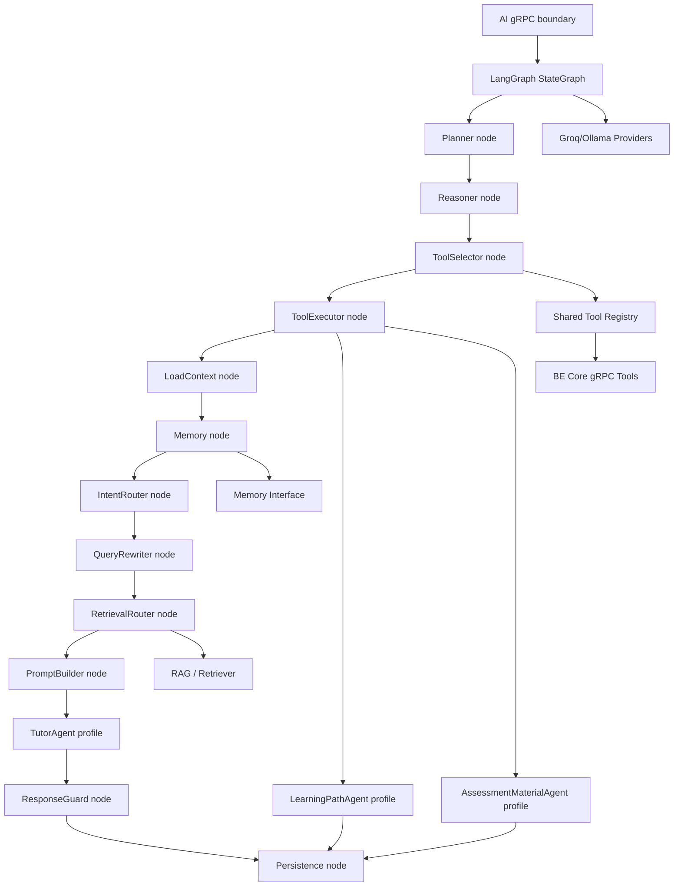

# AI Service Architecture

Source diagram: `docs/architechture.webp`.

This document is the technical source of truth for AI Service. Mermaid diagrams
are the canonical architecture format; Canva or exported images are presentation
artifacts only.

## Service Role

AI Service owns AI execution only:

- LangGraph orchestration runtime.
- Planner, reasoner, tool selector, tool executor, and persistence nodes.
- Three V1 domain agent profiles: `TutorAgent`, `LearningPathAgent`, and
  `AssessmentMaterialAgent`.
- Prompt registry, business-domain policy, RAG, short-lived memory, model calls,
  worker execution, and model/tool observability.

AI Service must not own public auth, LMS CRUD, durable LMS invariants, direct
PostgreSQL LMS writes, or file-byte transport through gRPC. Durable domain reads
and writes go through BE Core gRPC.

## Current Baseline

| Area | Status |
| --- | --- |
| `apps/api-gateway` | Public HTTP ingress with Gateway Swagger, Clerk auth, Cloudinary upload, realtime helpers, and BE Core gRPC client. |
| `apps/backend` | BE Core source of truth with Prisma/PostgreSQL, Clerk/RBAC, jobs, notifications, learning, chat, academic, assessment, storage, and users modules. |
| `libs/contracts` | Shared DTOs, mappers, gRPC constants, proto path helpers, and domain proto files. |
| `apps/ai-service` | Python 3.14 foundation under `src/`: gRPC runtime, RabbitMQ workers, shared proto codegen, metadata/errors, BE Core tools, LangGraph runtime, Groq/Ollama providers, Qdrant RAG, Redis memory, and domain profiles. |
| Redis/RabbitMQ | Present in local infra and wired into AI Service memory/workers. |
| Qdrant | Wired as the AI Service vector DB for material chunks. |

## Agent Model

AI Service V1 uses **one shared agent runtime** and **three domain agent
profiles**. Planner, reasoner, and tool selector are runtime nodes, not agents.

| Agent profile | Responsibility | BE Core domains |
| --- | --- | --- |
| `TutorAgent` | Chat tutor, RAG answers, citations, assistant message persistence. | `chat.sessions`, `chat.messages`, `learning.materials`, `academic.courses/classes/lessons` |
| `LearningPathAgent` | Roadmap generation, recommendations, next actions, mastery-aware learning paths. | `learning.roadmaps`, `learning.mastery`, `assessments.analytics`, `chat.analytics` |
| `AssessmentMaterialAgent` | Material ingestion, quiz generation, grading, rubric feedback, chunk sync. | `learning.materials`, `storage`, `jobs`, `assessments.exams/questions/submissions/results` |

`RoadmapAgent` and `RecommendationAgent` are intentionally one profile:
`LearningPathAgent`. `ExamQuizAgent` and `MaterialAgent` are intentionally one
profile: `AssessmentMaterialAgent`, because assessment generation and grading
depend on RAG-ready material.

## Container Architecture

```mermaid
flowchart LR
  Client["Web / Mobile Client"]
  Gateway["API Gateway\nNestJS public edge"]
  BE["BE Core\nNestJS + Prisma"]
  AI["AI Service\nPython gRPC runtime"]
  Worker["AI Workers\nRabbitMQ consumers"]
  PG[("PostgreSQL\nLMS source of truth")]
  Rabbit[("RabbitMQ\nDurable work queues")]
  Redis[("Redis\nScratch/session memory")]
  Qdrant[("Qdrant\nVector DB")]
  Storage[("Cloudinary / Object Storage")]
  Model["Groq LLM / Ollama Embeddings"]

  Client -->|"HTTPS REST / SSE"| Gateway
  Gateway -->|"gRPC unary"| BE
  Gateway -. "AI token streaming only" .->|"gRPC server streaming"| AI
  BE -->|"gRPC unary / streaming"| AI
  BE -->|"Prisma"| PG
  BE -->|"create DB job + publish"| Rabbit
  AI -->|"publish AI-owned job/event"| Rabbit
  Worker -->|"consume"| Rabbit
  AI -->|"domain read/write"| BE
  Worker -->|"domain write"| BE
  AI --> Redis
  AI --> Qdrant
  Worker --> Qdrant
  Gateway --> Storage
  AI --> Storage
  AI --> Model
  Worker --> Model
```

## LangGraph Runtime



LangGraph owns state transitions, branching, retries, and agent profile routing.
TutorAgent prompts are built by explicit orchestrator nodes so retrieval mode,
memory, and business policy are visible in state. AI Service does not use
LangChain prompt templates; prompt text is rendered through the local prompt
registry.

MCP is optional after V1. The first implementation uses a local typed tool
registry with a contract shape that can later be wrapped by MCP.

## Data Ownership For Material Chunks

- BE Core owns material lifecycle and chunk manifest rows.
- `material_chunks` is a manifest table, not the primary full-text store. It
  keeps order, preview, checksum, storage key, source metadata, and embedding ID.
- Qdrant owns vectors and the full chunk payload used for semantic QA.
- Ordered summaries read ordered material context from Qdrant scroll in V1; a
  chunk JSONL object-storage manifest can replace this later without changing
  public APIs.

## Known Failure Modes And Guards

- Summary questions must not use semantic topK search; they use ordered
  material chunks.
- Chat history is sanitized before prompting because corrupted assistant output
  can otherwise poison later turns.
- Re-ingest deletes Qdrant points for the material before fresh upsert to avoid
  stale citations.
- Material status must be `ready` before RAG retrieval.

## Public And Internal Flow

Default production path:

```txt
Client -> API Gateway -> BE Core -> AI Service
```

Streaming chat path:

```txt
Client SSE -> API Gateway -> AI Service gRPC stream
```

The streaming path still requires delegated user context and domain scope from
Gateway/BE Core. AI Service cannot infer access rights by itself.

Internal metadata must propagate:

```txt
authorization: Bearer <clerk_jwt>       # only when delegated user context is required
x-service-token: <internal_service_token>
x-request-id: <uuid>
x-correlation-id: <uuid>
x-user-id: <clerk_user_id>
x-class-id: <optional_uuid>
x-ai-job-id: <optional_uuid>
```

## Target Module Layout

```txt
apps/ai-service/
  pyproject.toml
  README.md
  src/
    config/
      settings.py
      logging.py
    contracts/
      generate_proto.py
      generated/
    agents/
      orchestrator/
        state.py
        graph.py
        builder.py
        context.py
        dependencies.py
        streaming.py
        planner.py
        reasoner.py
        tool_selector.py
        tool_executor.py
        persistence.py
        nodes/
          context.py
          memory.py
          intent.py
          query.py
          policy.py
          retrieval.py
          prompt.py
          guard.py
      prompts/
        registry.py
      profiles/
        tutor.py
        learning_path.py
        assessment_material.py
      clients/
        be_core.py
        be_core_common.py
        be_core_domains/
      grpc/
        server.py
        interceptors.py
        metadata.py
        services.py
      providers/
        llm_provider.py
        embedding_provider.py
        factory.py
      rag/
        parsers.py
        chunking.py
        embeddings.py
        vector_stores/
        retrieval.py
        citations.py
      memory/
        session_memory.py
      tools/
        registry.py
      workers/
        worker.py
        material_ingest_worker.py
        ingestion/
        grading_worker.py
        roadmap_worker.py
      ops/
        maintenance.py
      observability/
        telemetry.py
```

Current code implements this V1 baseline. MCP wrappers and Gateway SSE
translation remain separate services/hardening work.

## Contract Boundary

AI gRPC contracts are owned by:

```txt
libs/contracts/proto/ai/
  orchestrator.proto
  jobs.proto
  rag.proto
```

Rules:

- Pass IDs and execution options, not large domain snapshots.
- Use BE Core gRPC to read latest domain context and persist final outputs.
- Never send uploaded file bytes through gRPC; use storage URLs or signed URLs.
- Use server streaming only for token/state streams.
- Use RabbitMQ + BE Core `jobs` for durable background workflows.

## Remaining Hardening Backlog

1. Add Gateway SSE translation for `AiOrchestratorService.StreamChatResponse`.
2. Expand prompt registry coverage with file-backed versions if prompts need
   runtime editing.
3. Add MCP wrappers only after local typed tools stabilize.
4. Add broader evaluation and provider-backed smoke coverage when local
   credentials and infra are available.
