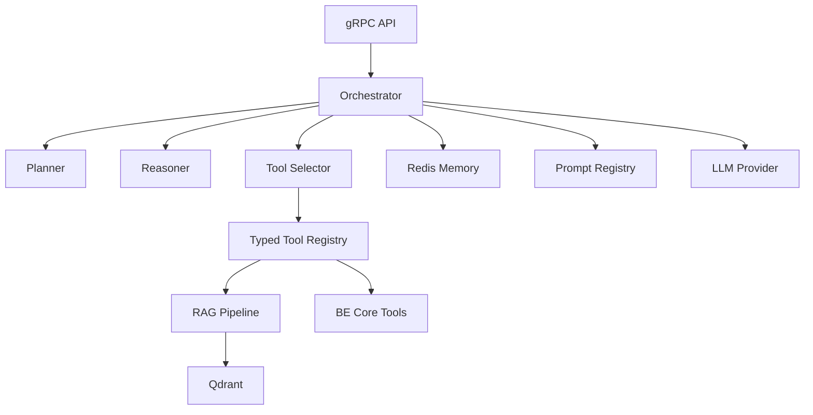

# AI Service Architecture

Source diagram: `docs/architechture.webp`.

This document formats the target AI Service architecture for the current EdTech
repository. Mermaid diagrams are the technical source; Canva or exported images
are presentation artifacts only.

## Service Role

AI Service owns AI execution only:

- Orchestrator execution loop.
- Planner, reasoner, and tool selector.
- Tutor, material ingestion, assessment grading, roadmap, and analytics agents.
- Prompt registry and business-domain policy.
- Retrieval augmented generation over learning materials.
- Short-lived interactive/session memory.
- LLM and embedding provider calls.
- AI workers and model/tool observability.

AI Service must not own:

- Public client authentication.
- Course, classroom, lesson, exam, user, or enrollment CRUD.
- Durable LMS domain invariants.
- Direct writes to PostgreSQL LMS tables.
- File-byte transport through gRPC.

Durable domain reads and writes go through BE Core gRPC. BE Core remains the
source of truth.

## Current Implementation Baseline

| Area | Status |
| --- | --- |
| `apps/api-gateway` | Implemented public HTTP ingress with Gateway Swagger, Clerk auth, Cloudinary upload, realtime helpers, and BE Core gRPC client. |
| `apps/backend` | Implemented BE Core gRPC service with Prisma/PostgreSQL, Clerk/RBAC guards, jobs, notifications, learning, chat, academic, assessment, storage, and users modules. |
| `libs/contracts` | Implemented shared DTOs, mappers, gRPC constants, proto path helpers, and domain proto files. |
| `apps/ai-service` | Minimal Python skeleton only: no package structure, gRPC server, workers, orchestrator, RAG, Redis, Qdrant, prompt registry, MCP, or provider adapters yet. |
| `libs/contracts/proto/ai` | AI proto contracts exist for the target service boundary. |
| Redis/RabbitMQ | Redis and RabbitMQ are present in local compose; BE Core has RabbitMQ/job foundation. |
| Qdrant | Target vector DB; not wired into compose or code yet. |

## Container Architecture

```mermaid
flowchart LR
  Client["Web / Mobile Client"]
  Gateway["API Gateway\nNestJS public edge"]
  BE["BE Core\nNestJS + Prisma"]
  AI["AI Service\nPython + FastAPI ops + gRPC"]
  Worker["AI Workers\nRabbitMQ consumers"]
  PG[("PostgreSQL\nLMS source of truth")]
  Rabbit[("RabbitMQ\nDurable work queues")]
  Redis[("Redis\nScratch/session memory")]
  Qdrant[("Qdrant\nVector DB")]
  Storage[("Cloudinary / Object Storage")]
  LLM["LLM / Embedding Provider"]

  Client -->|"HTTPS REST / SSE"| Gateway
  Gateway -->|"gRPC unary"| BE
  Gateway -. "AI token streaming only" .->|"gRPC server streaming"| AI
  BE -->|"gRPC unary / streaming"| AI
  BE -->|"Prisma"| PG
  BE -->|"create DB job + publish"| Rabbit
  AI -->|"publish AI-owned job/event"| Rabbit
  Worker -->|"consume"| Rabbit
  AI -->|"domain read/write"| BE
  Worker -->|"domain write"| BE
  AI --> Redis
  AI --> Qdrant
  Worker --> Qdrant
  Gateway --> Storage
  AI --> Storage
  AI --> LLM
  Worker --> LLM
```

## Public And Internal Flow

Default production request path:

```txt
Client -> API Gateway -> BE Core -> AI Service
```

Streaming chat path:

```txt
Client SSE -> API Gateway -> AI Service gRPC stream
```

The streaming path still requires delegated user context and domain scope from
Gateway/BE Core. AI Service cannot infer access rights by itself.

Internal metadata must propagate:

```txt
authorization: Bearer <clerk_jwt>       # only when delegated user context is required
x-service-token: <internal_service_token>
x-request-id: <uuid>
x-correlation-id: <uuid>
x-user-id: <clerk_user_id>
x-class-id: <optional_uuid>
x-ai-job-id: <optional_uuid>
```

## Target Module Layout

```txt
apps/ai-service/
  pyproject.toml
  README.md
  src/
    ai_service/
      main.py
      config/
        settings.py
        logging.py
      api/
        health.py
        readiness.py
        metrics.py
      grpc/
        server.py
        interceptors.py
        metadata.py
        orchestrator_service.py
        jobs_service.py
        rag_service.py
      orchestrator/
        state.py
        execution_loop.py
        planner.py
        reasoner.py
        tool_selector.py
      agents/
        tutor_agent.py
        material_agent.py
        assessment_agent.py
        roadmap_agent.py
        analytics_agent.py
      rag/
        parsers.py
        chunking.py
        embeddings.py
        vector_store.py
        retrieval.py
        citations.py
      memory/
        session_memory.py
        interactive_memory.py
        policy_memory.py
        retrieval_memory.py
      tools/
        registry.py
        be_core_tools.py
        retrieval_tools.py
        storage_tools.py
        job_tools.py
      workers/
        worker.py
        material_ingest_worker.py
        grading_worker.py
        roadmap_worker.py
        recommendation_worker.py
      providers/
        llm_provider.py
        embedding_provider.py
      observability/
        audit.py
        telemetry.py
        token_usage.py
      tests/
        unit/
        integration/
```

## Contract Boundary

AI gRPC contracts are owned by:

```txt
libs/contracts/proto/ai/
  orchestrator.proto
  jobs.proto
  rag.proto
```

TypeScript callers must use:

```txt
libs/contracts/src/grpc/packages.ts
libs/contracts/src/grpc/services.ts
libs/contracts/src/grpc/methods.ts
libs/contracts/src/grpc/proto-paths.ts
```

Rules:

- Pass IDs and execution options, not large domain snapshots.
- Use BE Core gRPC to read the latest domain context.
- Never send uploaded file bytes through gRPC; use storage URLs or signed URLs.
- Use server streaming only for token/state streams.
- Use RabbitMQ + BE Core `jobs` for durable background workflows.

## Runtime Components



MCP is optional for V1. The first implementation should use a local typed tool
registry with the same contract shape so MCP can be added later without changing
agent behavior.

## Missing Implementation Backlog

1. Move the flat `main.py` skeleton into the target `src/ai_service` package.
2. Add FastAPI health/readiness endpoints.
3. Add gRPC server bootstrap for `AiOrchestratorService`, `AiJobsService`, and
   `AiRagService`.
4. Add BE Core gRPC client and internal metadata handling.
5. Add RabbitMQ worker foundation and job status updates through BE Core.
6. Add material ingestion worker, parser, chunker, embedding provider, and Qdrant
   vector store.
7. Add Redis-backed interactive/session memory.
8. Add LLM and embedding provider abstractions with deterministic fake providers
   for tests.
9. Add orchestrator execution loop, planner, reasoner, and tool selector.
10. Add chat streaming, grading, roadmap, and recommendation workers.
