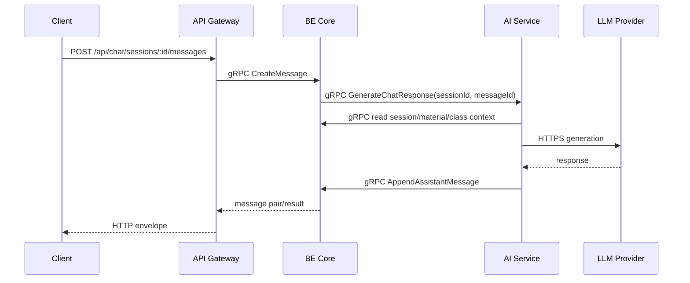
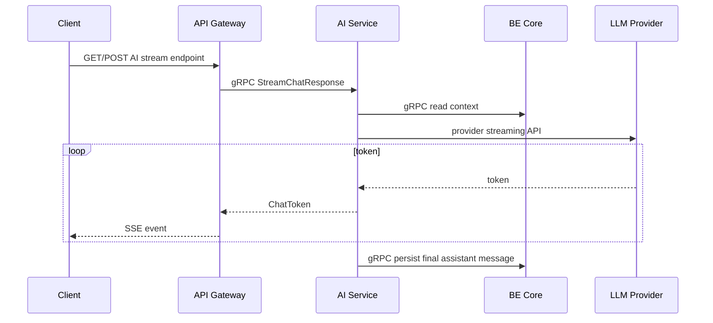
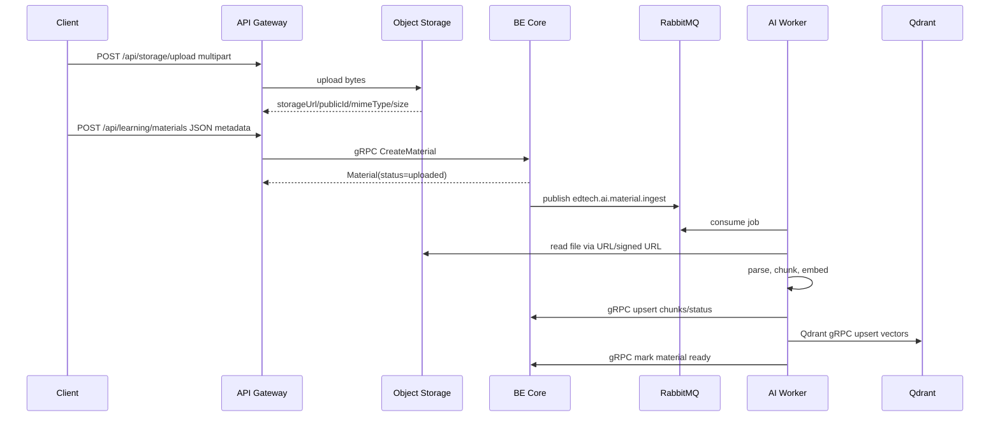
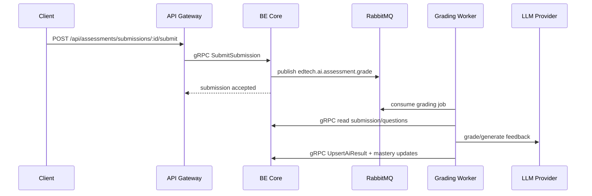
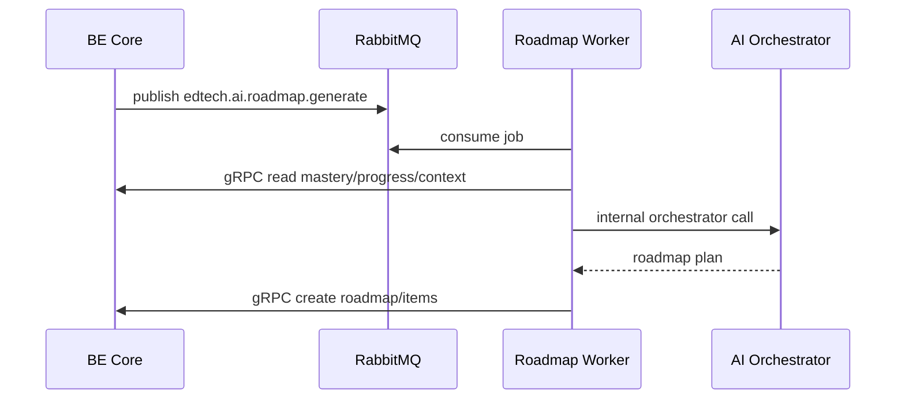

# AI Service Architecture

Source diagram: `docs/architechture.webp`.

This document is the target architecture for `apps/ai-service` in this repository. It is intentionally practical for the current codebase:

- API Gateway is the public ingress.
- BE Core is the system of record.
- AI Service owns orchestration, RAG, memory, prompts, tools, model calls, and AI workers.
- gRPC is used for synchronous typed calls and streaming.
- RabbitMQ plus BE Core DB `jobs` is used for long-running jobs and domain events.
- Redis is used for short-lived execution/session memory.
- Qdrant gRPC is used for vector search.

## Current State

| Area | Current Status |
| --- | --- |
| `apps/api-gateway` | Implemented. Public HTTP ingress, Swagger, Clerk auth, Cloudinary upload, one BE Core gRPC client. |
| `apps/backend` | Implemented. REST compatibility surface, BE Core gRPC facades, Prisma/PostgreSQL persistence. |
| `libs/contracts` | Implemented. Shared DTOs, proto files, gRPC constants, proto path helpers, pure mappers. |
| `apps/ai-service` | Empty folder. No runtime yet. |
| `libs/contracts/proto/ai` | Missing. |
| RabbitMQ/Redis/Qdrant | RabbitMQ job foundation exists in BE Core; Redis/Qdrant are not wired in code yet. |
| Agent runtime | Not implemented. |

The project is currently at the "Gateway + BE Core foundation" stage. This document defines the next architecture milestone.

## Ownership

### AI Service Owns

- Orchestrator execution loop.
- Planner, reasoner, tool selector.
- Specialist agents:
  - tutor/chat agent
  - material ingestion agent
  - assessment grading agent
  - roadmap/recommendation agent
  - analytics/mastery insight agent
- Prompt registry:
  - system prompts
  - user prompt templates
  - tool-calling prompts
  - business domain policy
- AI memory:
  - interactive execution memory
  - session scratch state
  - retrieval memory interface
  - policy memory
- RAG:
  - file parsing
  - chunking
  - embedding
  - vector upsert/search
  - citation building
- LLM and embedding provider abstraction.
- AI job workers and retry behavior.
- AI observability:
  - model latency
  - token usage
  - tool-call audit
  - retrieval trace
  - job state transitions

### AI Service Must Not Own

- Public client authentication boundary.
- LMS CRUD persistence.
- Prisma schema/domain invariants.
- Course/class/lesson/enrollment/exam/submission/result/roadmap/mastery/user ownership.
- Large binary file transport through RPC.

Final persisted LMS state must go through BE Core gRPC facades unless a table is explicitly assigned to AI Service ownership later.

## Runtime Topology

```mermaid
flowchart LR
  Client["Web/Mobile Client"]
  Gateway["API Gateway\nHTTP + SSE public edge"]
  BE["BE Core\nDomain System of Record"]
  AI["AI Service\nOrchestrator + gRPC API"]
  Worker["AI Workers\nRabbitMQ consumers"]
  Rabbit["RabbitMQ\nDurable job queues + DLQ"]
  Redis["Redis\nInteractive/session memory"]
  Qdrant["Qdrant\ngRPC vector DB"]
  Storage["Cloudinary/Object Storage"]
  LLM["LLM/Embedding Provider\nHTTPS streaming API"]
  DB["PostgreSQL\nvia Prisma in BE Core"]

  Client -->|HTTPS REST| Gateway
  Client -->|SSE for AI streaming| Gateway
  Gateway -->|gRPC unary| BE
  Gateway -. AI streaming only .->|gRPC server streaming| AI
  BE -->|gRPC unary/server-streaming| AI
  BE -->|create DB job + publish| Rabbit
  AI -->|publish AI job/event when owned by AI| Rabbit
  Worker -->|consume durable job| Rabbit
  AI -->|gRPC unary domain read/write| BE
  Worker -->|gRPC unary domain write| BE
  BE -->|Prisma/PostgreSQL wire| DB
  Gateway -->|SDK HTTPS upload| Storage
  AI -->|SDK/signed URL read| Storage
  Worker -->|SDK/signed URL read| Storage
  AI -->|Redis protocol| Redis
  AI -->|Qdrant gRPC| Qdrant
  Worker -->|Qdrant gRPC| Qdrant
  AI -->|HTTPS/streaming| LLM
  Worker -->|HTTPS| LLM
```

## Communication Rules

Use both gRPC and event-driven communication. Do not force every interaction into one protocol.

| Scenario | Protocol | Reason |
| --- | --- | --- |
| Gateway -> BE Core LMS APIs | gRPC unary | Client needs immediate result and typed errors. |
| Gateway -> AI token streaming | gRPC server streaming internally, SSE publicly | Browser-compatible stream at edge, typed stream internally. |
| BE Core -> AI quick generation | gRPC unary | Caller needs immediate result. |
| BE Core -> AI token generation | gRPC server streaming | Stream tokens/state without waiting for full output. |
| BE Core -> AI long workflow | RabbitMQ job + BE DB job status | Durable retry, no request timeout pressure, queryable status. |
| Material ingest/chunk/embed | RabbitMQ job | Long-running, retryable, worker-scalable. |
| Submission AI grading | RabbitMQ job | Long-running and retryable. |
| Roadmap generation | RabbitMQ job | Can return job accepted and finish async. |
| Recommendation refresh | RabbitMQ event/job | Batch/background work. |
| Chat title generation | RabbitMQ job | Non-critical async enrichment. |
| AI/Worker -> BE Core persist result | gRPC unary | Worker needs success/failure confirmation. |
| AI/Worker -> Qdrant | Qdrant gRPC | Vector operations should avoid HTTP JSON overhead. |
| AI/Worker -> LLM provider | Provider HTTPS API | External provider constraint. |

Default rule:

```txt
If the caller needs the answer now: use gRPC.
If the work can finish later or needs retry/fan-out: publish an event/job.
If the browser needs token streaming: expose SSE at Gateway and use gRPC server streaming internally.
```

## Public API Policy

AI Service should not be a public browser-facing service.

Allowed HTTP endpoints in AI Service:

```txt
GET /health
GET /ready
GET /metrics            # internal network only
```

Optional admin endpoints are allowed only on private network and service auth.

Client-facing routes should remain in API Gateway:

```txt
/api/chat/*
/api/learning/*
/api/assessments/*
/api/ai/*               # future explicit AI public routes only
```

## Internal Metadata

All internal gRPC calls must carry:

```txt
authorization: Bearer <clerk_jwt>       # only when delegated user context is needed
x-service-token: <internal_service_token>
x-request-id: <uuid>
x-correlation-id: <uuid>
x-user-id: <clerk_user_id>
x-class-id: <optional_uuid>
x-ai-job-id: <optional_uuid>
```

`SERVICE_TOKEN` is required in staging and production. Later hardening can replace or complement it with mTLS.

## Folder Structure

```txt
apps/ai-service/
  pyproject.toml
  README.md
  src/
    ai_service/
      main.py
      config/
        settings.py
        logging.py
      api/
        health.py
        metrics.py
      grpc/
        server.py
        interceptors.py
        metadata.py
        ai_orchestrator_service.py
        ai_jobs_service.py
      contracts/
        proto_loader.py
        metadata.py
      orchestrator/
        state.py
        execution_loop.py
        planner.py
        reasoner.py
        tool_selector.py
      agents/
        tutor_agent.py
        material_agent.py
        assessment_agent.py
        roadmap_agent.py
        analytics_agent.py
      tools/
        registry.py
        be_core_tools.py
        retrieval_tools.py
        storage_tools.py
        job_tools.py
      mcp/
        server.py
        tool_contracts.py
      rag/
        parsers.py
        chunking.py
        embeddings.py
        vector_store.py
        retrieval.py
        reranking.py
        citations.py
      memory/
        interactive_memory.py
        session_memory.py
        retrieval_memory.py
        policy_memory.py
      prompts/
        system/
        user/
        tools/
        business_domain_policy.md
      providers/
        llm_provider.py
        embedding_provider.py
      clients/
        be_core_grpc_client.py
        object_storage_client.py
        qdrant_client.py
        redis_client.py
      events/
        nats_client.py
        subjects.py
        schemas.py
      workers/
        worker.py
        material_ingest_worker.py
        material_embed_worker.py
        grading_worker.py
        roadmap_worker.py
        recommendation_worker.py
        chat_title_worker.py
      observability/
        telemetry.py
        audit.py
        token_usage.py
      tests/
        unit/
        integration/
```

## Tech Stack

| Layer | Stack | Notes |
| --- | --- | --- |
| Runtime | Python 3.12 | Strongest fit for AI providers, parsing, RAG. |
| Package manager | `uv` or Poetry | Prefer `uv` for speed if project standardizes on it. |
| Health/admin API | FastAPI + Pydantic v2 | Internal health/admin only. |
| gRPC server/client | `grpcio`, `grpcio-tools` | Internal unary and server-streaming APIs. |
| Agent orchestration | Start with custom state machine; upgrade to LangGraph when needed | Avoid premature framework coupling while workflows are simple. |
| LLM provider | OpenAI-compatible abstraction | Keep model/provider swappable. |
| Embeddings | Provider abstraction | Store provider/model/dimension metadata. |
| Event bus | RabbitMQ + BE Core DB `jobs` | Durable work queues, retries, DLQ, queryable status. |
| Cache/memory | Redis | Execution scratchpad, session memory, rate/budget counters. |
| Vector DB | Qdrant gRPC | Production-like RAG search/upsert. |
| Object storage | Cloudinary/S3-compatible SDK or signed URL | File bytes stay out of gRPC. |
| Observability | OpenTelemetry + structured JSON logs | Trace request/job/tool/model spans. |

## Contract Ownership

Proto source of truth stays in:

```txt
libs/contracts/proto
```

Add AI contracts under:

```txt
libs/contracts/proto/ai/
  orchestrator.proto
  jobs.proto
  rag.proto
```

Add matching constants in:

```txt
libs/contracts/src/grpc/packages.ts
libs/contracts/src/grpc/services.ts
libs/contracts/src/grpc/methods.ts
libs/contracts/src/grpc/proto-paths.ts
```

Do not duplicate service names as string literals in Gateway, BE Core, or AI Service.

### Proposed AI gRPC Services

```proto
service AiOrchestratorService {
  rpc GenerateChatResponse(ChatGenerationRequest) returns (ChatGenerationResponse);
  rpc StreamChatResponse(ChatGenerationRequest) returns (stream ChatToken);
  rpc GenerateRoadmap(GenerateRoadmapRequest) returns (AiJobAccepted);
  rpc GradeSubmission(GradeSubmissionRequest) returns (AiJobAccepted);
  rpc IngestMaterial(IngestMaterialRequest) returns (AiJobAccepted);
}

service AiJobsService {
  rpc GetJobStatus(AiJobIdRequest) returns (AiJobStatus);
  rpc CancelJob(AiJobIdRequest) returns (AiJobStatus);
}

service AiRagService {
  rpc SearchMaterialContext(RagSearchRequest) returns (RagSearchResponse);
}
```

Payload rules:

- Pass IDs and execution options, not large domain snapshots.
- Use `google.protobuf.Struct` only for genuinely dynamic model/tool payloads.
- Never send uploaded file bytes through gRPC.
- Use server streaming only for token/state streams.

## Job Queues

Recommended RabbitMQ queues:

```txt
edtech.notification.dispatch
edtech.ai.material.ingest
edtech.ai.assessment.grade
edtech.ai.roadmap.generate
edtech.ai.recommendation.refresh
edtech.ai.chat.title.generate
```

Job ownership:

| Job type | Queue | Publisher | Consumer |
| --- | --- | --- | --- |
| `notification.dispatch` | `edtech.notification.dispatch` | BE Core | BE worker |
| `ai.material.ingest` | `edtech.ai.material.ingest` | BE Core | AI material worker |
| `ai.assessment.grade` | `edtech.ai.assessment.grade` | BE Core | AI grading worker |
| `ai.roadmap.generate` | `edtech.ai.roadmap.generate` | BE Core or AI Service | AI roadmap worker |
| `ai.recommendation.refresh` | `edtech.ai.recommendation.refresh` | BE Core scheduled job or AI Service | AI recommendation worker |
| `ai.chat.title.generate` | `edtech.ai.chat.title.generate` | BE Core or AI Service | AI chat worker |

Every job must include:

```json
{
  "jobId": "uuid",
  "type": "ai.material.ingest",
  "requestId": "uuid",
  "correlationId": "uuid",
  "userId": "user_123",
  "resourceId": "uuid",
  "attempts": 1,
  "createdAt": "2026-05-10T10:00:00.000Z"
}
```

BE Core stores job state in PostgreSQL first, then publishes `{ jobId, type, payload, requestId, correlationId }` to RabbitMQ. Workers update status through BE Core gRPC. RabbitMQ handles delivery and DLQ; DB `jobs` remains the status/audit source.

## Main Workflows

### Chat Response, Non-Streaming

Use this when the UI can wait for a full answer.



### Chat Response, Streaming

Use this when the UI needs token streaming.



### Material Ingestion

This is the first recommended async workflow to implement because BE Core already has `Material` and `MaterialChunk`.



### Assessment Grading



### Roadmap Generation



## Memory Architecture

| Memory Type | Backing Store | Lifetime | Purpose |
| --- | --- | --- | --- |
| Request context | gRPC metadata | single request/job | Auth, request IDs, correlation. |
| Interactive memory | Redis | minutes-hours | Agent scratchpad, intermediate plan/reasoning state. |
| Chat history | BE Core PostgreSQL | durable | User-visible messages and sessions. |
| Retrieval memory | Qdrant + BE `MaterialChunk` | durable | Semantic material context and citations. |
| Policy memory | Prompt files/config | versioned | Domain rules and tool-use constraints. |
| Audit trace | Logs/telemetry + optional BE job table | durable enough for ops | Debug model/tool/job behavior. |

Do not store durable user-visible conversation state only in Redis. Persist final chat messages through BE Core.

## Tool Architecture

Tools are explicit adapters. They should be typed, auditable, and policy-checked.

Required tool categories:

| Tool Category | Backing Interface |
| --- | --- |
| Academic tools | BE Core gRPC courses/classes/lessons/enrollments |
| Assessment tools | BE Core gRPC exams/questions/submissions/results |
| Chat tools | BE Core gRPC sessions/messages |
| Learning tools | BE Core gRPC materials/roadmaps/mastery |
| Retrieval tools | Qdrant gRPC + BE material metadata |
| Storage tools | Object storage SDK/signed URL |
| Job tools | RabbitMQ queues + BE job/status gRPC updates |

MCP can be used as the tool registry/execution protocol, but it is optional at first. If MCP slows down V1, implement a local tool registry with the same tool contract shape and add MCP later.

## Error Handling

gRPC status mapping:

| Error | gRPC status |
| --- | --- |
| Invalid prompt/options/input | `INVALID_ARGUMENT` |
| Missing/invalid service token | `UNAUTHENTICATED` |
| User cannot access class/material/submission | `PERMISSION_DENIED` |
| Referenced resource missing | `NOT_FOUND` |
| Job already exists/conflict | `ALREADY_EXISTS` |
| Model/provider timeout | `DEADLINE_EXCEEDED` |
| Rate/token budget exceeded | `RESOURCE_EXHAUSTED` |
| Provider unavailable | `UNAVAILABLE` |
| Unexpected bug | `INTERNAL` |

Event-driven jobs must also write final job state:

```txt
queued -> running -> succeeded
queued -> running -> failed
queued -> running -> retrying -> running
failed -> dead_lettered
```

## Environment Variables

```txt
PORT=8090
AI_GRPC_URL=0.0.0.0:50052
BE_CORE_GRPC_URL=localhost:50051
SERVICE_TOKEN=
RABBITMQ_URL=amqp://localhost:5672
RABBITMQ_EXCHANGE=edtech.jobs
RABBITMQ_PREFETCH=10
REDIS_URL=redis://localhost:6379
QDRANT_URL=http://localhost:6334
LLM_PROVIDER=openai
LLM_API_KEY=
LLM_MODEL=
EMBEDDING_PROVIDER=openai
EMBEDDING_API_KEY=
EMBEDDING_MODEL=
OBJECT_STORAGE_MODE=cloudinary
CLOUDINARY_NAME=
CLOUDINARY_API_KEY=
CLOUDINARY_API_SECRET=
OTEL_EXPORTER_OTLP_ENDPOINT=
```

`SERVICE_TOKEN`, provider keys, and storage secrets are required outside local development.

## Implementation Order

1. Scaffold Python project under `apps/ai-service`.
2. Add health API and gRPC server bootstrap.
3. Add AI proto contracts under `libs/contracts/proto/ai`.
4. Add shared contract constants for AI packages/services/methods.
5. Add AI Service BE Core gRPC client using existing domain proto contracts.
6. Add RabbitMQ publisher/consumer infrastructure and BE job status integration.
7. Implement material ingestion worker first.
8. Add Qdrant vector store adapter.
9. Add Redis interactive/session memory.
10. Add LLM and embedding provider abstraction.
11. Add orchestrator execution loop with planner, reasoner, tool selector.
12. Add chat streaming.
13. Add assessment grading.
14. Add roadmap/recommendation workers.
15. Add observability and job audit.

## Acceptance Criteria

AI Service is considered aligned with the target architecture when:

- It runs as an independent service under `apps/ai-service`.
- It exposes internal gRPC APIs from `libs/contracts/proto/ai`.
- It has health/readiness HTTP endpoints only for ops.
- It calls BE Core through gRPC for domain reads/writes.
- It uses RabbitMQ plus BE Core DB job status for long-running jobs.
- It uses Redis for short-lived execution/session memory.
- It uses Qdrant gRPC for retrieval.
- It does not write LMS domain data directly to PostgreSQL.
- It supports at least one streaming AI workflow.
- It supports material ingestion from uploaded storage URLs.
- It has structured logs/traces for model calls, tool calls, and job execution.
