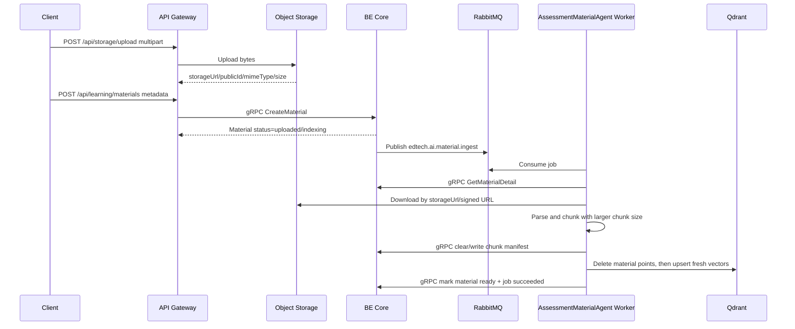
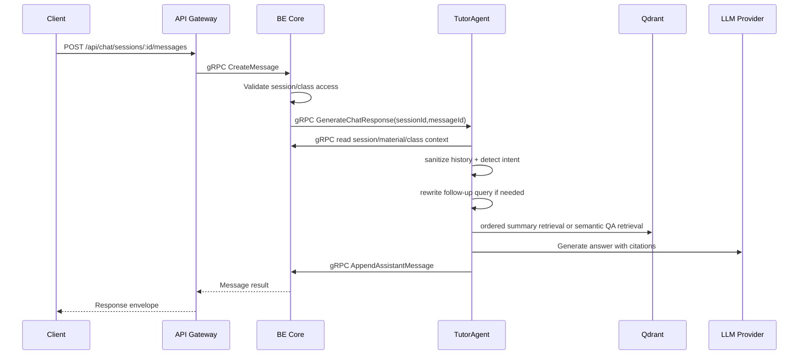
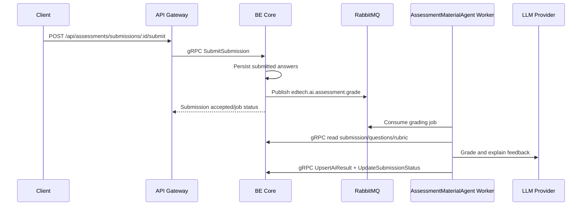
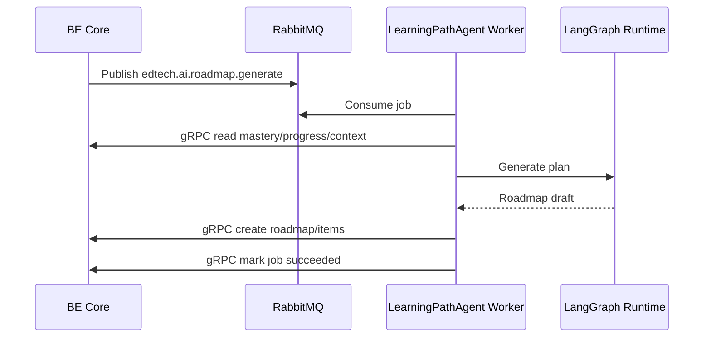

# AI Service Runtime Flows

## AssessmentMaterialAgent Material Ingestion



Rules:

- BE Core creates the job record before publishing to RabbitMQ.
- AI Worker acknowledges the message only after BE Core/Qdrant writes succeed.
- File bytes are never sent through gRPC.
- Material ingestion belongs to `AssessmentMaterialAgent` because quiz/exam
  generation and grading depend on RAG-ready source material.

## TutorAgent RAG Chat



Streaming variant:

```txt
Client SSE -> Gateway -> AiOrchestratorService.StreamChatResponse
```

AI Service streams tokens internally with gRPC server streaming; Gateway converts
the stream to browser-facing SSE events.

TutorAgent retrieval modes:

- `summary_material`: no vector search; read ordered chunks by `materialId`.
- `qa_material`: semantic Qdrant search with score threshold.
- `follow_up`: rewrite to a standalone question, then semantic search.
- `general_tutor`: answer without forced citations when no material context is
  present.

TutorAgent structured log steps:

- `context.load`
- `memory.load`
- `intent.detected`
- `query.rewritten`
- `retrieval.summary`
- `retrieval.semantic`
- `prompt.built`
- `model.stream`
- `response.sanitized`
- `persistence.saved`

## AssessmentMaterialAgent Grading



Rules:

- The worker writes grades through BE Core.
- Rubric and question context are loaded by ID.
- Provider-backed grading smoke checks run only when local Groq/Ollama config is
  available.

## LearningPathAgent Roadmap And Recommendation



Rules:

- Roadmaps are persisted by BE Core.
- AI Service produces drafts and recommendations only.
- Mastery and progress analytics stay BE-owned.
- Roadmap generation and recommendation are one profile:
  `LearningPathAgent`.
