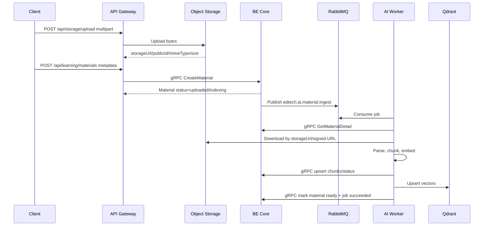
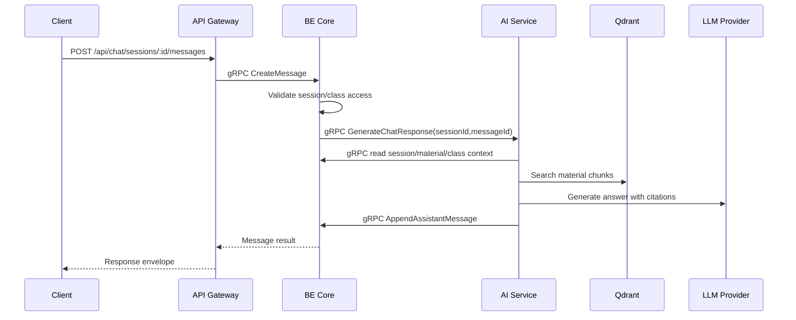
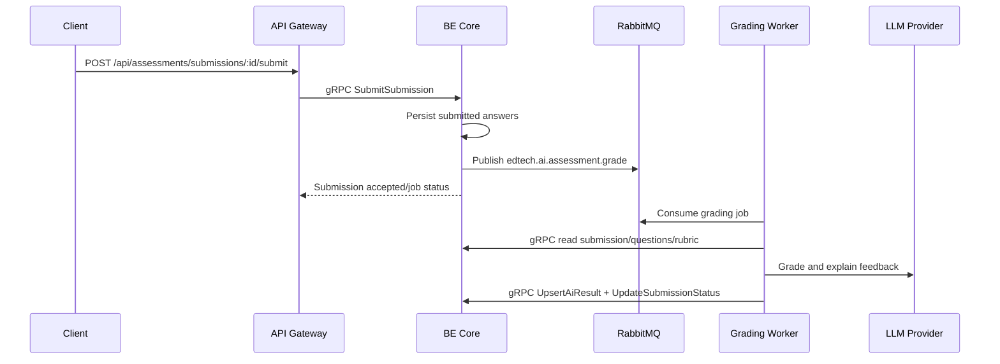
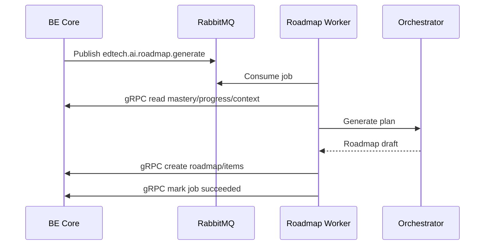

# AI Service Runtime Flows

## Material Ingestion



Rules:

- BE Core creates the job record before publishing to RabbitMQ.
- AI Worker acknowledges the message only after BE Core/Qdrant writes succeed.
- File bytes are never sent through gRPC.

## RAG Chat



Streaming variant:

```txt
Client SSE -> Gateway -> AiOrchestratorService.StreamChatResponse
```

AI Service streams tokens internally with gRPC server streaming; Gateway converts
the stream to browser-facing SSE events.

## Assessment Grading



Rules:

- The worker writes grades through BE Core.
- Rubric and question context are loaded by ID.
- CI uses a deterministic fake grading provider.

## Roadmap Generation



Rules:

- Roadmaps are persisted by BE Core.
- AI Service produces drafts and recommendations only.
- Mastery and progress analytics stay BE-owned.
