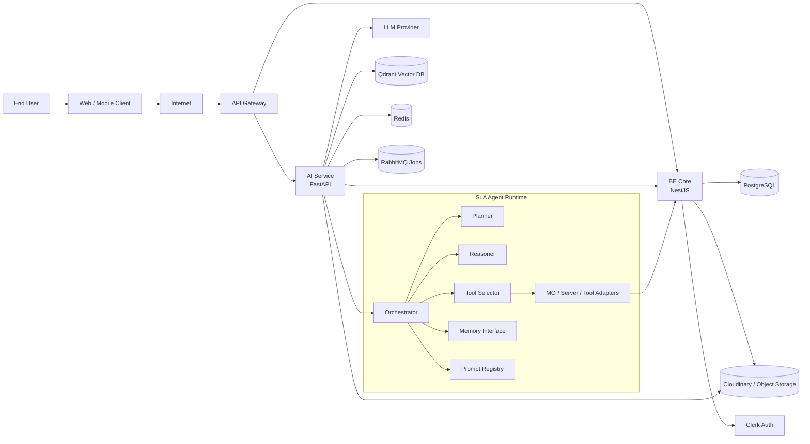
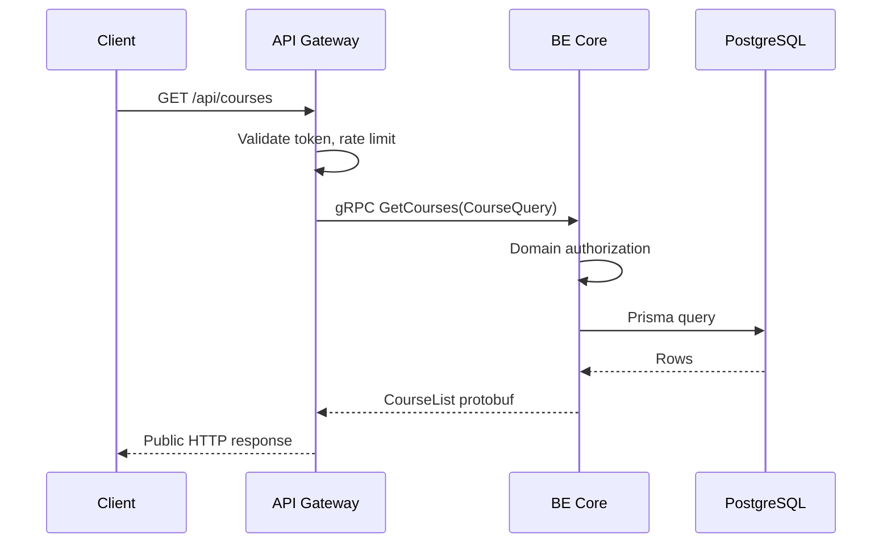
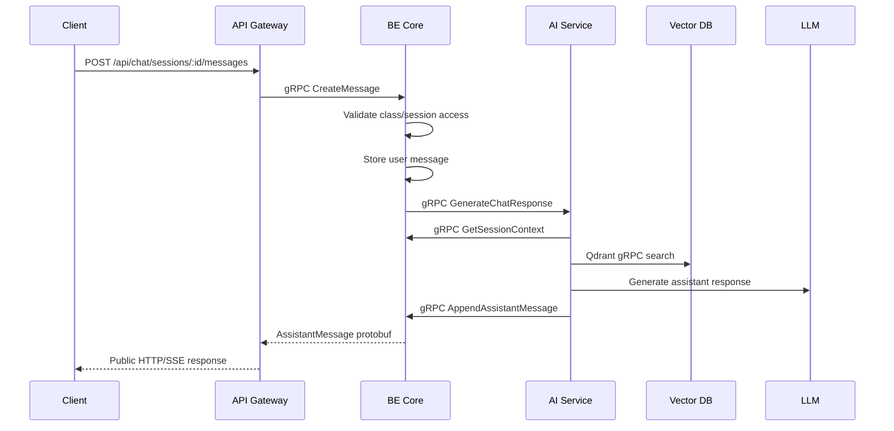
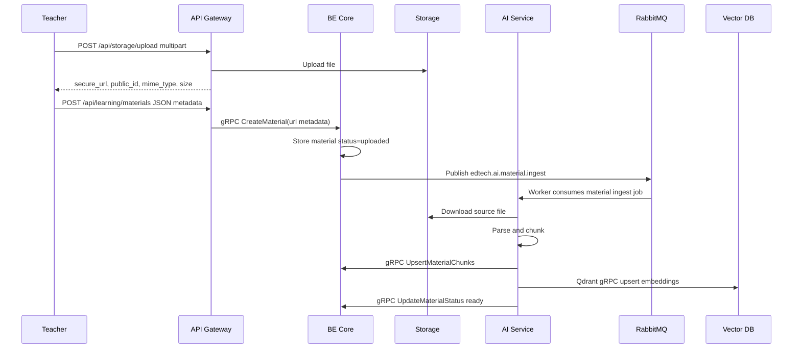
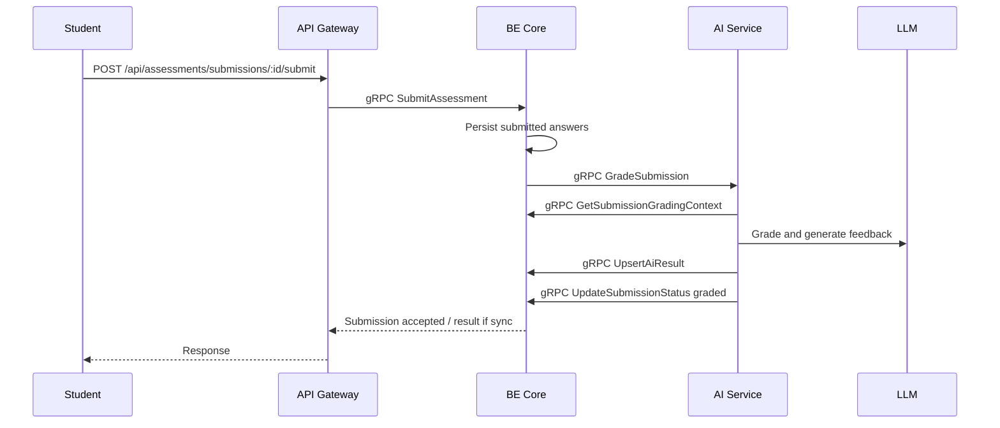

# SE-UIT SuA Agent Service Architecture

Version: `v1`

Last updated: `2026-05-10`

This document translates the SuA agent architecture diagram into a practical service architecture for the current EdTech codebase.

Current codebase baseline:

- Workspace: Nx monorepo.
- BE Core: `apps/backend`, NestJS 11, TypeScript, Prisma 7, PostgreSQL.
- Auth: Clerk through global NestJS guard.
- Storage: Cloudinary through the existing `storage` module.
- API contracts: `docs/api-contract`. The current public Gateway route contract is `docs/api-contract/gateway.md`; module files are supporting domain notes.
- AI service design docs already exist under `docs/ai-service`.
- Architecture scan against `docs/architechture.webp`: `docs/architecture-scan.md`.

The target architecture has three deployable services:

```txt
API Gateway
  -> BE Core
  -> AI Service
```

BE Core remains the system of record. AI Service owns orchestration, prompt execution, RAG, tool calling, and model interaction. API Gateway owns public ingress, routing, authentication boundary enforcement, and cross-service policies. In staging and production, client applications should enter through API Gateway; BE Core HTTP REST is retained for development and transition compatibility only.

---

## 1. High-Level Architecture



### Request Direction

```txt
Client
  -> API Gateway
  -> BE Core for normal LMS APIs
  -> AI Service for AI workflows
  -> BE Core internal gRPC services for domain reads/writes
  -> PostgreSQL / Storage
```

### Ownership Rule

| Area | API Gateway | BE Core | AI Service |
| --- | --- | --- | --- |
| Public ingress | Yes | No. HTTP REST is compatibility/dev only | No direct public requirement in production |
| Auth token extraction | Yes | Yes, validates delegated user context | Service token / delegated user verification |
| Domain authorization | Route-level coarse policy | Source of truth | Reads authorization context, does not bypass BE |
| Courses/classes/lessons | Route only | Owns CRUD | Reads context |
| Materials metadata | Route only | Owns CRUD and storage metadata | Parses, chunks, embeds |
| Chat messages | Route / streaming proxy | Stores sessions/messages | Generates assistant response |
| Exam/submission/result | Route only | Owns CRUD and status | Generates grading/feedback |
| Roadmaps/mastery | Route only | Stores final state | Generates drafts and recommendations |
| RAG/vector search | No | No | Owns |
| Tool calling/MCP | No | Exposes internal tools/APIs | Owns orchestration |

---

## 2. API Gateway Architecture

### Responsibility

API Gateway is the organization-facing ingress shown in the diagram. It should be thin and policy-oriented:

- Public HTTPS termination.
- Route traffic to BE Core and AI Service.
- Validate and forward Clerk JWTs.
- Attach `X-Request-Id`, `X-User-Id`, `X-Org-Id`, and service routing headers.
- Rate limit by user, IP, route family, and AI token budget.
- Protect internal service routes from browser access.
- Proxy streaming AI responses using SSE or WebSocket.
- Centralize CORS, request size limits, timeout budgets, and audit logs.
- Own public Swagger/OpenAPI documentation at `/api/docs`.

### Recommended Tech Stack

| Layer | Recommendation | Notes |
| --- | --- | --- |
| Runtime | Node.js 20 + NestJS or Fastify | Fits current TypeScript/NestJS codebase. |
| Gateway framework | NestJS gRPC client/server adapter or Envoy/Kong edge + NestJS gateway adapter | Public edge can stay HTTP-compatible; internal calls use gRPC. |
| Auth | Clerk JWT verification | Gateway should reject invalid public requests early. |
| Rate limit | Redis-backed rate limiter | Required for AI endpoints. |
| Cache | Redis | Short-lived route cache and token budget counters. |
| Internal RPC | gRPC + Protobuf | Gateway translates public HTTP/SSE to internal gRPC. |
| Observability | OpenTelemetry + structured JSON logs | Propagate `requestId` to BE and AI. |
| Deployment | Docker container behind Nginx/Cloudflare/Load Balancer | Gateway is horizontally scalable. |

### Public Route Map

```txt
/api/auth/*                 -> BE Core
/api/users/*                -> BE Core
/api/courses/*              -> BE Core
/api/classes/*              -> BE Core
/api/classrooms/*           -> BE Core compatibility route, if retained
/api/enrollments/*          -> BE Core
/api/lessons/*              -> BE Core
/api/learning/*             -> BE Core
/api/assessments/*          -> BE Core
/api/chat/sessions*         -> BE Core
/api/chat/*/messages*       -> BE Core
/api/storage/*              -> BE Core

/api/ai/chat/respond        -> AI Service through BE-mediated context or direct service route
/api/ai/chat/respond/stream -> AI Service streaming proxy
/api/ai/materials/*         -> AI Service, service-protected
/api/ai/roadmaps/*          -> AI Service, service-protected
/api/ai/assessments/*       -> AI Service, service-protected
/api/ai/jobs/*              -> AI Service, service-protected
```

Recommended production rule:

```txt
Browser -> Gateway -> BE Core -> AI Service
```

Use direct Gateway -> AI Service only for streaming or explicitly designed AI-facing endpoints. Even then, AI Service must receive enough delegated context to enforce scope.

### Folder Structure

```txt
apps/
  api-gateway/
    src/
      main.ts
      app.module.ts
      config/
        env.schema.ts
        gateway.config.ts
      common/
        guards/
          clerk-jwt.guard.ts
          service-route.guard.ts
        interceptors/
          request-id.interceptor.ts
          proxy-logging.interceptor.ts
        filters/
          gateway-exception.filter.ts
        middleware/
          rate-limit.middleware.ts
      routes/
        be-core.routes.ts
        ai-service.routes.ts
        route-policy.registry.ts
      proxy/
        proxy.module.ts
        proxy.service.ts
        sse-proxy.service.ts
      clients/
        be-core.grpc-client.ts
        ai-service.grpc-client.ts
      observability/
        logger.ts
        telemetry.ts
      health/
        health.controller.ts
  libs/
    contracts/
      proto/
      src/
        grpc/
        dtos/
        mappers/
```

---

## 3. BE Core Architecture

### Current Implementation

BE Core already exists at:

```txt
apps/backend
```

It is a NestJS application with global prefix:

```txt
/api
```

BE Core HTTP REST remains available during migration, but it should be treated as development and compatibility surface only. Production clients should call API Gateway, which forwards internal requests to BE Core gRPC.

Main runtime features already present:

- `ValidationPipe` with whitelist and transform.
- Swagger at `/api/docs`.
- Global response envelope interceptor.
- Global exception filter.
- Global Clerk auth guard.
- Request ID and request logging middleware.
- Prisma module as database access layer.
- Cloudinary-backed storage module.

BE Core Swagger is useful for backend development while REST controllers remain. Public client documentation should use API Gateway Swagger at `/api/docs`.

### Current Domain Modules

```txt
apps/backend/src/modules/
  app/
  auth/
  users/
  academic/
    courses/
    classrooms/
    enrollments/
    lessons/
  learning/
    materials/
    mastery/
    roadmaps/
  assessments/
    exams/
    questions/
    submissions/
    results/
    analytics/
  chat/
    sessions/
    messages/
    shared/
  storage/
  health/
```

### Responsibility

BE Core is the source of truth for LMS business data:

- User profile and auth session view.
- Course, class, enrollment, lesson lifecycle.
- Learning materials metadata and file upload coordination.
- Exams, questions, submissions, results.
- Chat session/message persistence.
- Roadmap and mastery persistence.
- Authorization rules for teacher/student ownership.
- Internal gRPC services used by AI Service to read/write final domain state.

### Recommended Tech Stack

| Layer | Current / Recommended | Notes |
| --- | --- | --- |
| Runtime | Node.js 20 | Existing Nx/NestJS stack. |
| Framework | NestJS 11 | Already implemented. |
| Language | TypeScript 5.9 | Already implemented. |
| Monorepo | Nx 22 | Already implemented. Use `npm exec nx ...`. |
| ORM | Prisma 7 | Already implemented. |
| Database | PostgreSQL | Source of truth. |
| Auth | Clerk | Already wired through global guard. |
| Storage | Cloudinary now, S3/R2 compatible later | Current module uses Cloudinary. |
| API docs | Swagger/OpenAPI | Already configured for dev/compatibility. API Gateway Swagger is the public client contract. |
| Validation | `class-validator`, `class-transformer` | Already used in DTOs. |
| Internal RPC | NestJS microservices gRPC transport + Protobuf contracts | Target protocol for service-to-service calls. |
| Background jobs/events | RabbitMQ + DB `jobs` | `jobs` persists status/audit; RabbitMQ dispatches durable work with retry/DLQ. |
| Observability | Structured logs + request ID | Request middleware already exists. |

### BE Core Internal gRPC Service Layer

AI Service should not write random domain data directly unless ownership is explicit. Add internal gRPC service modules when AI integration starts:

```txt
apps/backend/src/modules/internal/
  internal.module.ts
  guards/
    service-token.guard.ts
  materials/
    internal-materials.grpc.ts
    internal-materials.service.ts
  assessments/
    internal-assessments.grpc.ts
    internal-assessments.service.ts
  chat/
    internal-chat.grpc.ts
    internal-chat.service.ts
  jobs/
    internal-jobs.grpc.ts
    internal-jobs.service.ts
```

Suggested service methods:

```txt
InternalMaterialService.UpdateMaterialStatus
InternalMaterialService.UpsertMaterialChunks
InternalAssessmentService.UpsertAiResult
InternalAssessmentService.UpdateSubmissionStatus
InternalChatService.AppendAssistantMessage
InternalJobService.CreateJobStatus
InternalJobService.UpdateJobStatus
```

### BE Core Folder Standard

For each domain:

```txt
domain/
  dto/
    create-entity.dto.ts
    update-entity.dto.ts
    entity-query.dto.ts
  entity.controller.ts
  entity.service.ts
  entity.module.ts
```

For shared backend infrastructure:

```txt
common/
  decorators/
  dto/
  errors/
  filters/
  interceptors/
  middlewares/
  prisma/
  providers/
  types/
```

This matches the existing backend structure and should be preserved.

---

## 4. AI Service Architecture

Detailed AI Service documentation now lives in `docs/ai-service/architecture.md`.

Current repository status: `apps/ai-service/` has an initial Python 3.14 foundation with package structure, FastAPI ops endpoints, Nx targets, gRPC/codegen helpers, metadata/error utilities, real BE Core gRPC client tools, real Groq/Ollama provider adapters, RAG primitives, in-memory session memory, worker foundations, and a lightweight chat orchestrator. The real SuA Agent runtime shown in `docs/architechture.webp` is still incomplete: Redis/Qdrant/RabbitMQ adapters, MCP server, Gateway SSE bridge, planner/reasoner/tool selector, and production observability are not wired yet.

### Responsibility

AI Service implements the SuA Agent runtime:

- Orchestrator execution loop.
- Planner.
- Reasoner.
- Tool selector.
- MCP server/tool adapters.
- Prompt registry for system/user/tool-calling prompts.
- Interactive memory and retrieval memory.
- RAG over `MaterialChunk` and vector DB.
- Tutor chat generation.
- Material ingestion, parsing, chunking, embedding.
- Assessment grading and feedback.
- Roadmap/recommendation generation.
- Mastery analysis.

### Recommended Tech Stack

| Layer | Recommendation | Notes |
| --- | --- | --- |
| Runtime | Python 3.14 | Requested AI Service runtime. Use standard CPython 3.14 first; free-threaded/no-GIL builds are out of V1. |
| API framework | FastAPI + Pydantic v2 for health/admin/public compatibility | Internal service API should be gRPC. |
| Internal RPC | `grpcio` + Protobuf | Handles unary calls and AI server-streaming responses. |
| Server | Uvicorn / Gunicorn | Container runtime. |
| Agent orchestration | LangGraph or custom lightweight orchestrator | Use LangGraph if workflows branch/retry heavily. |
| LLM provider | OpenAI-compatible SDK abstraction | Keep provider swappable. |
| Embeddings | OpenAI / local embedding model | Store provider/model metadata. |
| Vector DB | Qdrant gRPC recommended, Chroma acceptable for local dev | Qdrant gRPC is the default production-like path. |
| Queue/events | RabbitMQ + BE Core DB `jobs` | Async work, retry, durable queues, dead-letter handling, and queryable job status. |
| Cache/session memory | Redis | Short-lived execution context and rate/budget data. |
| Persistence | BE Core internal gRPC services first | Direct PostgreSQL only for worker-owned tables if approved. |
| Document parsing | `pypdf`, `python-docx`, `python-pptx`, optional Unstructured | Material ingestion pipeline. |
| Observability | OpenTelemetry + structured logs | Include model/token metrics. |

### AI Runtime Components

```txt
api/
  Routers expose service APIs.

orchestrator/
  Owns execution loop and agent state transitions.

agents/
  Planner, Reasoner, Tutor, Assessment, Roadmap, Analytics agents.

tools/
  Tool definitions and adapters for BE Core APIs, retrieval, storage, and external services.

mcp/
  MCP server and tool registry if tool calls are exposed through MCP.

rag/
  Retrieval, reranking, citation building, vector DB sync.

memory/
  Interactive memory, short-term session state, long-term retrieval memory.

prompts/
  Versioned system prompts, user prompt templates, tool-calling prompts, business domain policy.

workers/
  Background processors for ingestion, embedding, grading, recommendation refresh.
```

### AI Service Folder Structure

```txt
apps/
  ai-service/
    pyproject.toml
    README.md
    src/
      ai_service/
        main.py
        config/
          settings.py
          logging.py
        api/
          router.py
          health.py
          chat.py
          materials.py
          assessments.py
          roadmaps.py
          recommendations.py
          jobs.py
        schemas/
          common.py
          chat.py
          materials.py
          assessments.py
          roadmaps.py
          jobs.py
        orchestrator/
          state.py
          graph.py
          execution_loop.py
          planner.py
          reasoner.py
          tool_selector.py
        agents/
          tutor_agent.py
          assessment_agent.py
          roadmap_agent.py
          analytics_agent.py
        tools/
          registry.py
          be_core_tools.py
          retrieval_tools.py
          storage_tools.py
        mcp/
          server.py
          tool_contracts.py
        rag/
          chunking.py
          embeddings.py
          vector_store.py
          retrieval.py
          citations.py
        memory/
          interactive_memory.py
          session_memory.py
          policy_memory.py
        prompts/
          system/
          user/
          tools/
          business_domain_policy.md
        providers/
          llm_provider.py
          embedding_provider.py
        clients/
          be_core_client.py
          storage_client.py
        workers/
          worker.py
          material_ingest_worker.py
          grading_worker.py
          roadmap_worker.py
        observability/
          telemetry.py
          audit.py
        tests/
          unit/
          integration/
```

---

## 5. Service Communication

Each service communicates through explicit network, event, or storage protocols. Do not share in-process modules across service boundaries. This keeps API Gateway, BE Core, and AI Service independently deployable.

Core rule:

```txt
Public APIs may use HTTP REST/GraphQL because browsers need HTTP compatibility.
Internal service-to-service APIs should not use REST JSON.
Internal synchronous APIs use gRPC + Protobuf by default.
Internal asynchronous work uses RabbitMQ plus BE Core DB `jobs` by default.
```

### Protocol Matrix

| Source | Target | Protocol | Purpose |
| --- | --- | --- | --- |
| Client | API Gateway | HTTPS REST/GraphQL + SSE/WebSocket | Browser-compatible public edge. |
| API Gateway | BE Core | gRPC unary + Protobuf | Typed internal calls for LMS APIs. |
| API Gateway | AI Service | gRPC unary/server-streaming | AI request/response and internal token streaming. |
| BE Core | AI Service | gRPC unary/server-streaming | Start AI workflows after authorization. |
| AI Service | BE Core internal gRPC services | gRPC unary + Protobuf | Read context and write AI outputs without JSON drift. |
| BE Core / AI Service | Event/job bus | RabbitMQ + DB `jobs` | Async jobs/events, retry, durable queues, DLQ, queryable status. |
| AI API | AI Workers | RabbitMQ work queue | Scale slow AI processing independently. |
| BE Core | PostgreSQL | Prisma/PostgreSQL wire protocol | Domain persistence. |
| AI Service | Vector DB | Qdrant gRPC | RAG indexing/search with typed binary protocol. |
| Services | Object Storage | SDK/signed URL over HTTPS | File transfer without pushing binary through RPC. |
| AI Service | LLM Provider | Provider HTTPS/streaming API | External provider constraint. |

### 5.1 Client -> API Gateway

Protocol:

```txt
HTTPS REST or GraphQL for browser-facing CRUD/public APIs
SSE for browser-facing one-way AI token streaming
WebSocket only for browser-facing bidirectional realtime features
```

Use HTTP only at the public edge because web and mobile clients integrate naturally with HTTPS. This does not mean internal services should use REST JSON. API Gateway translates public HTTP/SSE/WebSocket traffic into internal gRPC calls.

Use SSE for AI chat streaming because token streaming is mostly server-to-client. Use WebSocket only if the product needs two-way realtime interaction such as live class events, collaborative sessions, presence, or interruptible agent execution.

Examples:

```txt
GET  /api/courses
POST /api/chat/sessions/:sessionId/messages
GET  /api/ai/chat/respond/stream
```

Auth:

```txt
Authorization: Bearer <clerk_jwt>
```

### 5.2 API Gateway -> BE Core

Protocol:

```txt
gRPC unary + Protobuf over private network
```

This is the main internal path for LMS APIs. API Gateway performs coarse checks, translates the public request into a typed Protobuf message, then calls BE Core through gRPC. BE Core remains responsible for domain authorization.

Examples:

```txt
AcademicCourseService.GetCourses(CourseQuery)
AcademicClassroomService.CreateClassroom(CreateClassroomRequest)
AssessmentExamService.UpdateExam(UpdateExamRequest)
LearningMaterialService.DeleteMaterial(DeleteMaterialRequest)
```

Metadata:

```txt
Authorization: Bearer <clerk_jwt>
x-request-id: <uuid>
x-correlation-id: <uuid>
x-forwarded-for: <client_ip>
x-forwarded-proto: https
```

Reason:

- Protobuf gives explicit typed contracts.
- gRPC uses compact binary payloads and HTTP/2 multiplexing.
- Gateway can keep public HTTP compatibility while internal calls remain typed.
- Existing NestJS REST controllers can stay during transition, but the target internal protocol is gRPC.

### 5.3 API Gateway -> AI Service

Protocol:

```txt
gRPC unary for non-stream AI calls
gRPC server streaming for internal AI token streaming
```

Use this path only for intentionally exposed AI routes. Most AI workflows should go through BE Core first so BE Core can validate permissions and create domain records. For browser streaming, Gateway receives SSE/WebSocket from the client and translates it to gRPC server streaming internally.

Examples:

```txt
AiOrchestratorService.GenerateChatResponse(ChatRequest)
AiOrchestratorService.StreamChatResponse(ChatRequest) returns stream ChatToken
RecommendationService.GetNextLearningAction(NextLearningRequest)
```

Metadata:

```txt
Authorization: Bearer <clerk_jwt>
x-service-token: <gateway_to_ai_service_token>
x-request-id: <uuid>
x-correlation-id: <uuid>
x-user-id: <clerk_user_id>
```

Public SSE response format at Gateway:

```txt
Content-Type: text/event-stream

event: token
data: {"text":"A derivative"}

event: token
data: {"text":" measures change"}

event: done
data: {"messageId":"uuid"}
```

Internal AI Service stream shape:

```txt
stream ChatToken {
  text
  citation_refs
  usage_delta
  is_final
}
```

### 5.4 BE Core -> AI Service

Protocol:

```txt
gRPC unary for normal AI workflows
gRPC server streaming for AI token streaming
```

This is the preferred AI workflow initiation path. BE Core validates the user, checks permissions, stores any required user/domain records, then calls AI Service with typed Protobuf messages containing IDs and execution options.

Examples:

```txt
MaterialIngestionService.StartIngestion(StartMaterialIngestionRequest)
AiOrchestratorService.GenerateChatResponse(ChatRequest)
AiOrchestratorService.StreamChatResponse(ChatRequest) returns stream ChatToken
AssessmentGradingService.GradeSubmission(GradeSubmissionRequest)
RoadmapGenerationService.GenerateRoadmap(GenerateRoadmapRequest)
```

Metadata:

```txt
x-service-token: <be_core_to_ai_service_token>
x-request-id: <uuid>
x-correlation-id: <uuid>
x-user-id: <clerk_user_id>
x-class-id: <optional_class_uuid>
```

Protobuf requests should pass IDs instead of duplicating large domain payloads:

```proto
message ChatRequest {
  string session_id = 1;
  string message_id = 2;
  string user_id = 3;
  optional string class_id = 4;
  bool use_rag = 5;
  int32 top_k = 6;
}
```

AI Service then loads the latest context from BE Core internal gRPC services.

### 5.5 AI Service -> BE Core Internal gRPC Services

Protocol:

```txt
gRPC unary + Protobuf over private network
Service-token or mTLS protected
```

AI Service uses this path to read context and persist final AI outputs. These services must not be public.

Examples:

```txt
InternalChatService.GetSessionContext(GetSessionContextRequest)
InternalChatService.AppendAssistantMessage(AppendAssistantMessageRequest)
InternalMaterialService.GetMaterial(GetMaterialRequest)
InternalMaterialService.UpsertMaterialChunks(UpsertMaterialChunksRequest)
InternalMaterialService.UpdateMaterialStatus(UpdateMaterialStatusRequest)
InternalAssessmentService.UpsertAiResult(UpsertAiResultRequest)
InternalAssessmentService.UpdateSubmissionStatus(UpdateSubmissionStatusRequest)
InternalMasteryService.BulkUpsertMastery(BulkUpsertMasteryRequest)
```

Metadata:

```txt
x-service-token: <ai_service_to_be_core_token>
x-request-id: <uuid>
x-correlation-id: <uuid>
x-ai-job-id: <optional_job_uuid>
```

Reason:

- BE Core keeps ownership of domain invariants.
- AI Service does not duplicate Prisma schema rules.
- Authorization and audit stay centralized.
- Future schema changes affect BE Core APIs, not every AI worker.
- Protobuf prevents JSON field drift across services.

Direct database writes from AI Service should be avoided unless a table is explicitly assigned to AI Service ownership.

### 5.6 BE Core / AI Service -> Event/Job Bus

Protocol:

```txt
RabbitMQ durable queues + BE Core DB jobs
```

Use BE Core DB `jobs` as the status/audit source and RabbitMQ as the dispatch mechanism for service events and async jobs. RabbitMQ is the recommended architecture default for this repository because AI workers may be Python, jobs are work-queue oriented, and Kafka would be too heavy for the current workload. BullMQ is acceptable only if the team intentionally standardizes on Redis and Node-only workers.

Use cases:

- Domain jobs such as `notification.dispatch`, `ai.material.ingest`, `ai.assessment.grade`.
- Material ingestion.
- Document parsing.
- Embedding generation.
- Vector index sync.
- Auto grading.
- Recommendation refresh.
- Mastery analysis.

Job messages should be small JSON or Protobuf payloads published to RabbitMQ queues. Example:

```proto
message MaterialIngestRequested {
  string job_id = 1;
  string type = 2;
  string material_id = 3;
  string requested_by = 4;
  string request_id = 5;
  string correlation_id = 6;
}
```

Reason:

- Long AI tasks should not block HTTP requests.
- Retries and backoff are easier.
- Workers can scale independently from the API.
- Failed jobs can be inspected and retried.
- Durable queues, ack/nack, retry, and DLQ are first-class in RabbitMQ.

The `jobs` table is the primary query/audit surface. RabbitMQ is the delivery mechanism, not the source of truth.

### 5.7 AI Service API -> AI Workers

Protocol:

```txt
RabbitMQ work queue
```

BE Core and AI Service publish work items, and AI workers consume them from durable queues:

```txt
ai.material.ingest
ai.material.embed
ai.assessment.grade
ai.roadmap.generate
ai.recommendation.refresh
```

Workers acknowledge success only after AI outputs are persisted through BE Core internal gRPC services or the relevant vector DB operation succeeds.

### 5.8 BE Core -> PostgreSQL

Protocol:

```txt
PostgreSQL wire protocol through Prisma Client
```

Current implementation:

```txt
NestJS service -> PrismaService -> PostgreSQL
```

BE Core is the default writer for courses, classrooms, enrollments, lessons, materials metadata, exams, questions, submissions, results, chat sessions/messages, roadmaps, mastery, notifications, and jobs.

### 5.9 AI Service -> Vector DB

Protocol:

```txt
Qdrant gRPC
```

Recommended:

```txt
Qdrant gRPC client for staging/production
Chroma local client for local prototype only
```

Use cases:

- Upsert material chunk embeddings.
- Semantic search for RAG.
- Delete vectors when a material is deleted.
- Reindex changed chunks.

Vector payload should include BE Core IDs:

```json
{
  "id": "chunk_uuid",
  "vector": [0.012, 0.034],
  "payload": {
    "materialId": "uuid",
    "lessonId": "uuid",
    "courseId": "uuid",
    "classId": "uuid",
    "chunkId": "uuid",
    "orderNo": 1
  }
}
```

### 5.10 BE Core / AI Service -> Object Storage

Protocol:

```txt
Provider SDK over HTTPS
Signed URL over HTTPS for cross-service file download
```

Current BE Core storage:

```txt
Cloudinary SDK
```

Recommended flow:

```txt
Client -> Gateway -> BE Core -> Cloudinary upload
BE Core stores material.storageUrl
AI Service receives materialId
AI Service asks BE Core for material metadata
AI Service downloads file using signed URL or storageUrl
```

Do not send uploaded binary files from BE Core to AI Service through JSON. Use storage URLs.

### 5.11 AI Service -> LLM Provider

Protocol:

```txt
Provider HTTPS API
Streaming HTTPS/SSE when supported
```

Examples:

```txt
AI Service -> OpenAI-compatible generation API
AI Service -> Embeddings API
```

Rules:

- API keys stay only in AI Service.
- Gateway and BE Core must never receive provider secrets.
- Log model name, token counts, latency, and request ID.
- Do not log full private prompts unless audit mode is explicitly enabled.

### gRPC Metadata

All internal gRPC calls should propagate:

```txt
authorization: Bearer <clerk_jwt>
x-service-token: <internal_token>
x-request-id: <uuid>
x-correlation-id: <uuid>
x-user-id: <clerk_user_id>
x-class-id: <optional_uuid>
```

Use `authorization` only when delegated user context is needed. Use `x-service-token` or mTLS for internal service authentication.

### gRPC Method Styles

```txt
Unary: normal read/write commands and short AI tasks.
Server streaming: AI token streaming from AI Service to Gateway or BE Core.
Client streaming: large chunk ingestion only if storage URLs are not enough.
Bidirectional streaming: interruptible agent loops or realtime replan sessions only.
```

Default to unary for internal service calls. Use streaming only when the workflow actually streams tokens, chunks, or interactive agent state.

### gRPC Error Model

Use gRPC status codes instead of JSON error envelopes for internal calls:

| gRPC status | Meaning |
| --- | --- |
| `INVALID_ARGUMENT` | Validation error. |
| `UNAUTHENTICATED` | Missing or invalid token. |
| `PERMISSION_DENIED` | Authenticated but not allowed. |
| `NOT_FOUND` | Resource not found. |
| `ALREADY_EXISTS` | Duplicate/conflict. |
| `FAILED_PRECONDITION` | Valid request but domain state blocks action. |
| `RESOURCE_EXHAUSTED` | Rate limit, quota, or token budget exceeded. |
| `INTERNAL` | Unexpected service error. |

Gateway maps gRPC errors back to the public HTTP response envelope for browser clients.

### Protobuf Contract Placement

Recommended contract location:

```txt
libs/contracts/
  proto/
    common/
      envelope.proto
      identity.proto
      pagination.proto
    academic/
      courses.proto
      classrooms.proto
    learning/
      materials.proto
      roadmaps.proto
      mastery.proto
    chat/
      chat.proto
    assessments/
      grading.proto
    ai/
      ai_orchestrator.proto
      ai_jobs.proto
    events/
      material_events.proto
      assessment_events.proto
      chat_events.proto
  src/
    grpc/
      proto-paths.ts
      packages.ts
      services.ts
      methods.ts
    dtos/
    mappers/
```

`libs/contracts/proto/` is the wire-contract source of truth. API Gateway, BE Core, and future AI services must resolve proto files through `@edtech/contracts` helpers such as `getProtoRoot()` and `getAllProtoPaths()` instead of hard-coding filesystem paths.

### Timeout Budget

| Route Type | Gateway Timeout | Backend Timeout | AI Timeout |
| --- | ---: | ---: | ---: |
| CRUD | 10s | 8s | Not applicable |
| File upload metadata | 30s | 25s | Not applicable |
| AI non-stream response | 60s | 55s | 50s |
| AI streaming | 5 min | 5 min | 5 min |
| Background job enqueue | 10s | 8s | 8s |
| Background worker | Not gateway-bound | Not request-bound | Job-specific |

---

## 6. Main Workflows

### 6.1 LMS CRUD



### 6.2 RAG Chat



### 6.3 Material Ingestion



### 6.4 AI Grading



---

## 7. Deployment Topology

```txt
docker-compose or Kubernetes namespace
  api-gateway
  be-core
  ai-service
  ai-worker
  postgres
  rabbitmq
  redis
  qdrant
```

Recommended environments:

```txt
local
  API Gateway optional, BE Core and AI Service can run directly.

staging
  API Gateway required, service auth enabled, RabbitMQ, Redis, and Qdrant enabled.

production
  Gateway public only, BE Core and AI Service private network only.
  SERVICE_TOKEN is required for all internal gRPC calls.
  BE Core HTTP REST should be private or disabled when ENABLE_BE_HTTP_PUBLIC=false is implemented.
```

### Environment Variables

API Gateway:

```txt
PORT
BE_CORE_GRPC_URL
AI_SERVICE_GRPC_URL
CLERK_PUBLISHABLE_KEY
CLERK_SECRET_KEY
CLOUDINARY_NAME
CLOUDINARY_API_KEY
CLOUDINARY_API_SECRET
REDIS_URL
SERVICE_TOKEN
```

`SERVICE_TOKEN` is required in staging and production. It must match BE Core `SERVICE_TOKEN` so Gateway can call BE Core gRPC. `CLOUDINARY_*` is required for Gateway `/api/storage/upload`; material creation receives JSON metadata with the uploaded file URL instead of multipart bytes.

BE Core:

```txt
PORT
DATABASE_URL
CLERK_PUBLISHABLE_KEY
CLERK_SECRET_KEY
CLOUDINARY_NAME
CLOUDINARY_API_KEY
CLOUDINARY_API_SECRET
AI_SERVICE_GRPC_URL
RABBITMQ_URL
RABBITMQ_EXCHANGE
RABBITMQ_PREFETCH
SERVICE_TOKEN
ENABLE_BE_HTTP_PUBLIC
ENABLE_BE_WORKERS
```

`SERVICE_TOKEN` is required in staging and production for BE Core gRPC. `ENABLE_BE_HTTP_PUBLIC=false` is a future hardening flag for disabling public BE Core REST exposure; REST controllers and Clerk auth remain during migration.

AI Service:

```txt
PORT
BE_CORE_GRPC_URL
SERVICE_TOKEN
RABBITMQ_URL
RABBITMQ_EXCHANGE
RABBITMQ_PREFETCH
REDIS_URL
QDRANT_URL
LLM_PROVIDER
LLM_API_KEY
EMBEDDING_PROVIDER
EMBEDDING_API_KEY
```

---

## 8. Implementation Roadmap

### Phase 1: Stabilize BE Core

- Keep current NestJS module layout.
- Add missing internal gRPC services only when needed by AI workflows.
- Ensure every endpoint follows response envelope and request ID propagation.
- Keep Swagger contracts updated.

### Phase 2: Build AI Service Skeleton

- Create `apps/ai-service`.
- Implement health/admin HTTP routes only where useful; implement internal gRPC service APIs with `grpcio`.
- Implement BE Core gRPC client with service token or mTLS.
- Add material ingestion and RAG search first because current schema already has `MaterialChunk`.

### Phase 3: Add Gateway

- Create `apps/api-gateway`.
- Translate existing public `/api/*` HTTP traffic to BE Core gRPC calls.
- Add rate limits and request ID propagation.
- Add SSE-to-gRPC-server-streaming bridge only for AI chat streaming.

### Phase 4: Agent Runtime

- Add orchestrator execution state.
- Add planner/reasoner/tool selector.
- Add prompt registry and business domain policy.
- Add MCP/tool adapters for BE Core context lookup.

### Phase 5: Production Hardening

- Add OpenTelemetry traces across Gateway, BE Core, AI Service.
- Add RabbitMQ-backed queue workers and DLQ policies.
- Add vector DB backup/reindex procedure.
- Add AI audit logging with token usage and model metadata.
- Add service-to-service network isolation.

---

## 9. Architecture Decisions

### ADR-001: BE Core Is Source of Truth

All LMS domain data remains in BE Core and PostgreSQL. AI Service may generate data, but final persisted state should go through BE Core internal gRPC services unless a table is explicitly assigned to AI Service ownership.

### ADR-002: AI Service Is Not a CRUD Backend

AI Service owns reasoning, retrieval, prompt execution, and model interaction. It should not duplicate Course, Classroom, Lesson, Exam, or User CRUD logic.

### ADR-003: API Gateway Stays Thin

Gateway should route, protect, rate-limit, observe, and proxy streams. It should not implement business workflows.

### ADR-004: Public HTTP Is an Edge Concern

Public REST/GraphQL/SSE can remain at API Gateway for browser compatibility. Internal service-to-service calls should use gRPC + Protobuf by default, including server streaming for AI token streams.

### ADR-005: Use RabbitMQ + DB Jobs for Async Service Work

The Prisma schema contains `Job`, and BE Core owns job status persistence. Async dispatch uses RabbitMQ for durable work queues, retries, and dead-letter handling. Kafka is reserved for future analytics/event streaming scale, and BullMQ is acceptable only if workers stay Node/Redis-centric.

---

## 10. Naming and Repo Placement

Recommended final Nx layout:

```txt
apps/
  backend/          # Current BE Core
  api-gateway/      # New public ingress service
  ai-service/       # New Python/FastAPI service or wrapped as Nx project
  backend-e2e/

docs/
  api-contract/
  ai-service/
  database/
  flow/
  system-architechture.md
```

If AI Service is kept outside Nx initially, place it under:

```txt
services/
  ai-service/
```

But the recommended approach for this repository is to keep it in `apps/ai-service` so architecture, docs, CI, and deployment remain in one monorepo.
